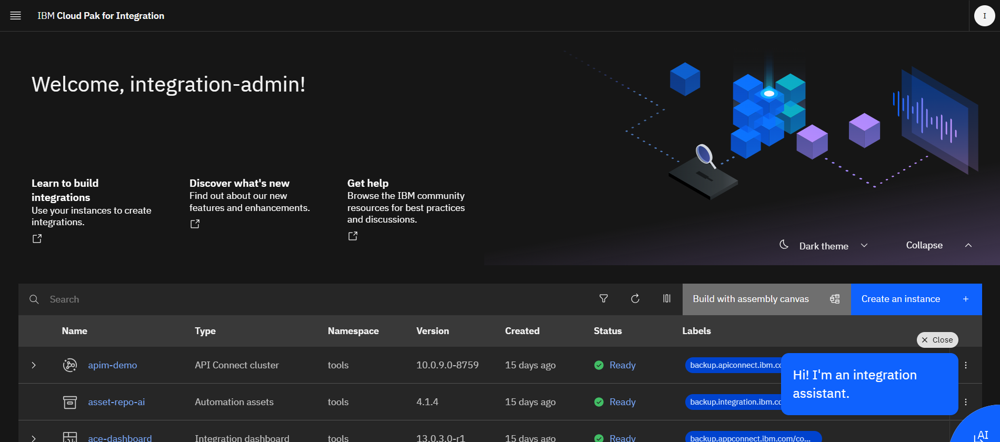

# Introduction
### **Access CP4I Portal Page**

IBM Cloud Pak for Integration is a comprehensive hybrid integration platform that connects applications, data, and services across on-premises and multi-cloud environments. It unifies key integration capabilities – including API management, application integration, enterprise messaging, event streaming, and high-speed data transfer – into a single, AI-powered solution. This helps organizations accelerate their digital transformation by securely and reliably connecting their diverse IT landscape.
   - Go to this link `https://cp4i-navigator-pn-tools.apps.itz-tx7iu2.infra01-lb.tok04.techzone.ibm.com/` in your browser [here](https://cp4i-navigator-pn-tools.apps.itz-tx7iu2.infra01-lb.tok04.techzone.ibm.com/)
   

   - login
   
---

### 1. **Access Event Stream Portal (Lab 1)**

An Event Stream is a continuous, real-time flow of data made up of a series of "events," ordered by the time they occurred. Each event represents a significant change in state, action, or occurrence within a system or business    
   - Click event stream cluster with name `es-demo` or just click [here](https://es-demo-ibm-es-ui-tools.apps.itz-tx7iu2.infra01-lb.tok04.techzone.ibm.com/gettingstarted)
   
   - You will see dashboard event stream like this picture.
   
   - Now, you can go to [Lab 1](https://github.com/Client-Engineering-Indonesia/workshop-maybank-2025/blob/main/Lab%201%20-%20Event%20Automation/lab-1.md)
---

### 2. **Access Event Endpoint Management/EEM Portal (Lab 2)**

Event Endpoint Management (EEM) is a capability that allows organizations to discover, govern, and secure access to their event streams.
   - Click event endpoint management(EEM) with name `eem-demo-mgr` or just click [here](https://eem-demo-mgr-ibm-eem-manager-tools.apps.itz-tx7iu2.infra01-lb.tok04.techzone.ibm.com/topics)
   
   - Now, you can go to [Lab 2](https://github.com/Client-Engineering-Indonesia/workshop-maybank-2025/blob/main/Lab%201%20-%20Event%20Automation/lab-2.md)
   

### 2. **Access Event Processing/EP Portal (Lab 3)**

Event Processing is a scalable, low-code event stream processing platform that helps you transform and act on data in real time.
   - Click event processing(EP) with name `ep-demo` or just click [here](https://ep-demo-ibm-ep-rt-tools.apps.itz-tx7iu2.infra01-lb.tok04.techzone.ibm.com)
   
   - Now, you can go to [Lab 3](https://github.com/Client-Engineering-Indonesia/workshop-maybank-2025/blob/main/Lab%201%20-%20Event%20Automation/lab-3.md)
   

