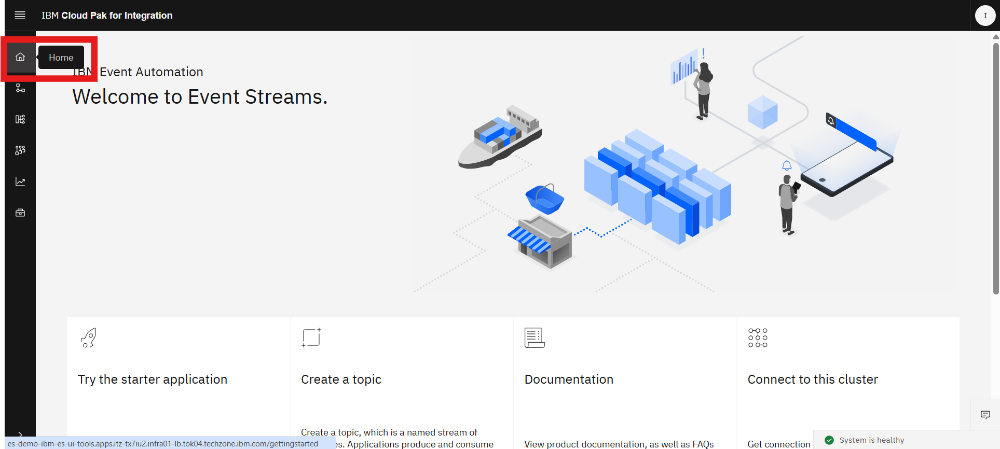
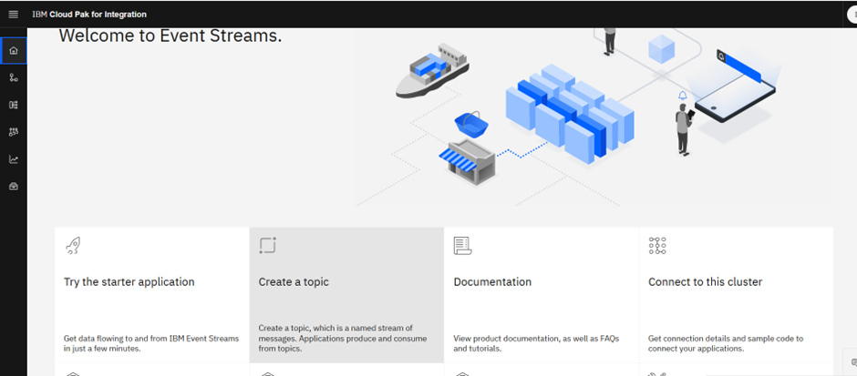
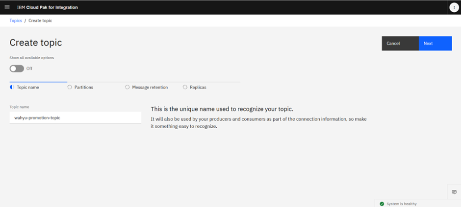
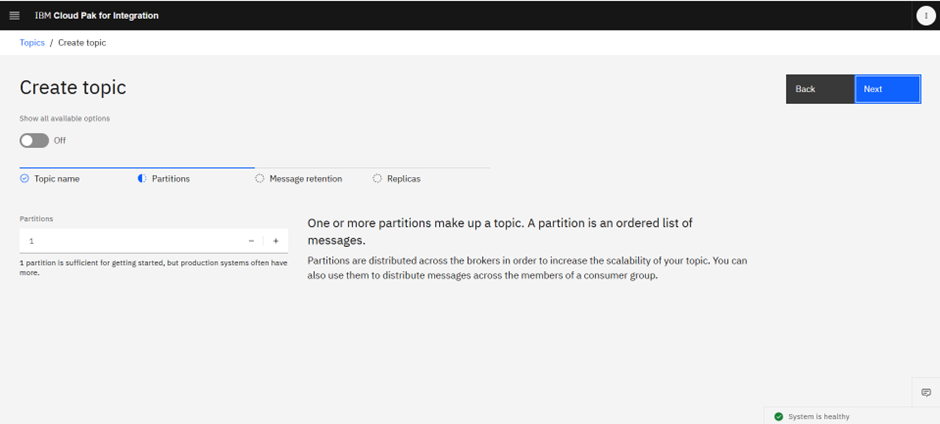
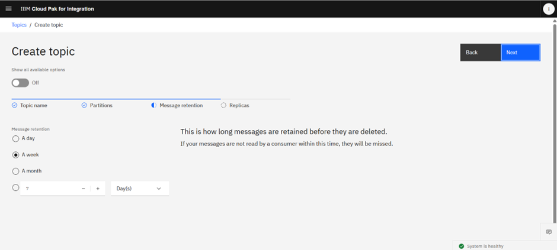
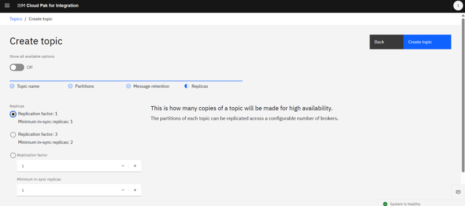
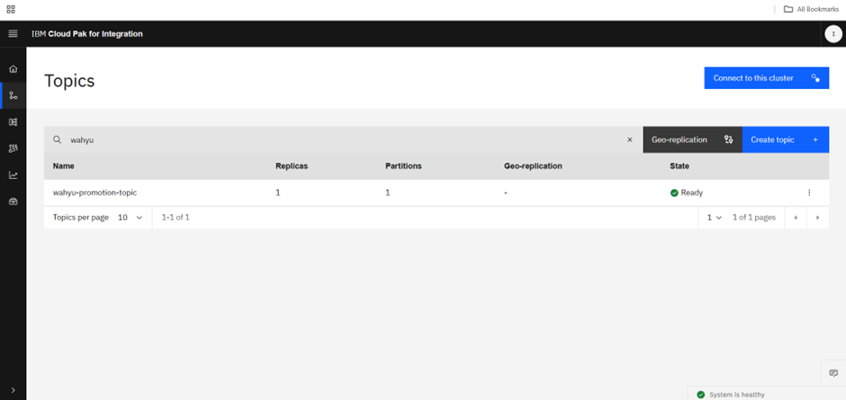

## Creating a Event Stream topic

1. Log in to the Event Streams UI from a supported web browser
2. Click Home in the primary navigation

3.	Click the Create a topic tile

4.	Enter a topic name in the Topic name field, for example, XXX-promotion-topic. This is the name of the topic that an application will be producing to or consuming from.

5.	Enter the number of Partitions, for example, 1. Partitions are used for scaling and distributing topic data across the Apache Kafka brokers. For the purposes of a basic starter application, using only 1 partition is sufficient.

6.	Select a Message retention, for example, A day. This is how long messages are retained before they are deleted.
Click Next.

7.	Select a replication factor in Replicas, for example, Replication factor: 1. This is how many copies of a topic will be made for high availability.

8.	Click Create topic. The topic is created and can be viewed from the Topics tab located in the primary navigation.
