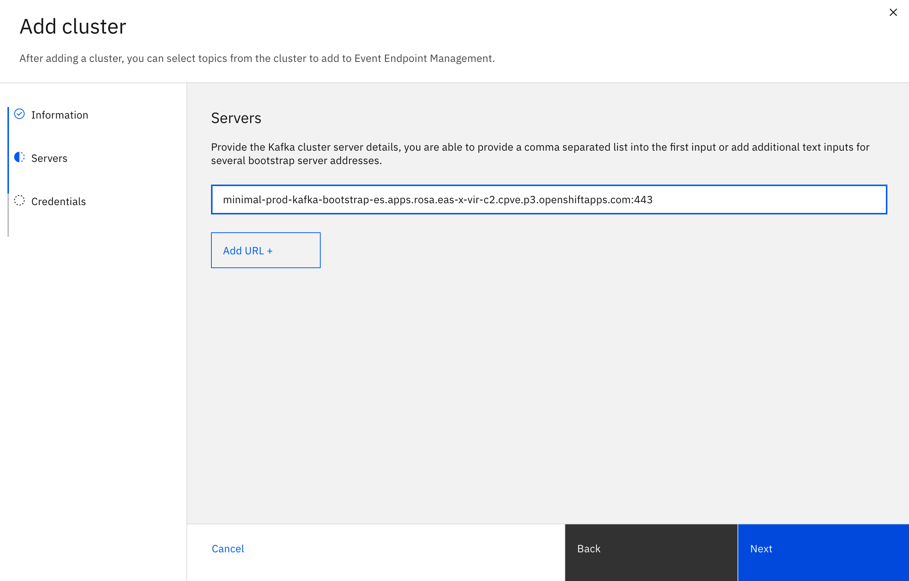

## Event Endpoint Management
Add a topic to Event Endpoint Management to make it available to others as an event source. In this guide, you are adding a topic to consume events from.

1. In the navigation pane, click **Manage topics**.

2. Click **Add topic**.

3. In the Interaction pane, select how your application will interact with the event source. Click Consume events and click Next.

4. Enter a unique name for your new cluster, and click Next.

5. Enter the bootstrap server URL for your Kafka cluster, and click Next.

**Note**: After you click Next, Event Endpoint Management validates the entered server URL. While validating, if any untrusted certificates are found on the bootstrap server URLs, you are asked to confirm whether you accept the certificates found. If you do, select the Accept all certificates checkbox, and click Next.

6. Optional: If the Kafka endpoint is configured to require mutual TLS authentication, then you must upload the private and public keys (ask your Kafka cluster administrator if you do not have them). Upload the private and public keys in PEM format.

7. **Optional**: If the entered bootstrap server URLs require SASL credentials to authenticate with Kafka, you are prompted to provide credential details. If required, select the Security protocol, and enter your username and password.

8. Click **Next**.

9. Select a topic to add from the list of topics available on this cluster.

10. **Optional**: If a name is not added by default, enter a unique event source name for the topic selected.

Note: The event source name is the unique ID that identifies your topics.

11. Click **Add Topic**.