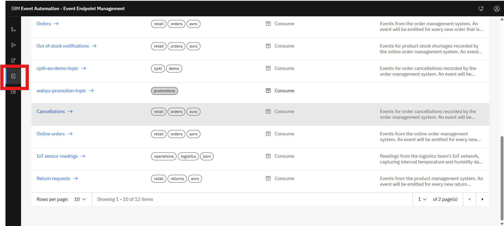

## Event Endpoint Management
Add a topic to Event Endpoint Management to make it available to others as an event source. In this guide, you are adding a topic to consume events from.

### Exposing topic event stream

1. In the navigation pane, click **Manage topics**.

2. Click **Add topic**.

3. In the Interaction pane, select how your application will interact with the event source. Click Consume events and click Next.

5. Select your cluster which you create topic previously (**maybank-cluster-es**).

4. Select your topic from the list of topics available on this cluster.

10. **Optional**: If a name is not added by default, enter a unique event source name for the topic selected.

Note: The event source name is the unique ID that identifies your topics.

11. Click **Add Topic**. And you can see topic active on list page **Manage Topics**

### Add Additional Information For Endpoint Topic
1. Click on the topic you previously created. You will be redirected to the detailed configuration page.

2. Click **Edit Information** 

3. Fill **Overview Information**

4. Go to **Event Information**

fill the detail:
   - Mesage format: JSON
   - Upload schema: [click here](assets/json/promotions.json)
   - Sample message: [click here](assets/json/sample.json)

5. Click **Save**

### Add Configuration From Topics Management

1. Click on the topic you previously created. You will be redirected to the detailed configuration page.

2. Click Options on detail configuration.

3. Click On **Create Option**

4. Fill blank text box

    - Option Name: Configuration <**your-topic-name**>
    - Alias: <**your-topic-name-approval**>

5. Add new control 

6. Choose **Approval** and **Schema Filtering** to add flow approval for this topic.

7. Click **Save**

8. You will redirect to main detail config page. in this page, click **Publish**

### Checking Active Publihed Topic Endpoint

1. Click on **catalog** menu on navbar.

2. Choose your topic

3. Page fill show how to connect and its rules.
