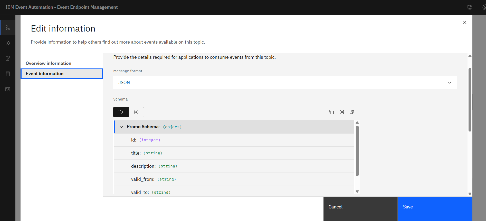

## Generating custom properties for custom filters

### Step 1 - Discover the topics to use

1. Go to the **Event Endpoint Management catalog**.


2. The Orders topic contains events about **orders** that are made.


### Step 2 - Provide a source of events

1. Click **Create** to create New Flow.


2. Click edit **event source**

3. Choose **add event source**


4. Fill credentials. You can get credentials of Topic Endpoint Managenet from subscribe on catalog menu on EEM.


5. Choose topic to add as source


6. Set massage format as JSON


7. Set Event details. set name as **promotions event source**


### Step 3 : Checking category

1. Create a **Transform node**.

Create a transform node by dragging one onto the canvas. You can find this in the Processors section of the left panel.
Click and drag from the small gray dot on the event source to the matching dot on the transform node.

2. Hover over the transform node and click **Edit** icon Edit to configure the node.
Call the transform node **Mark isPublish**.


3. Create a new property called **isPublish**.

Suggested value for the property:

```IF(category = 'internet', 0, 1)```

4. You can leave the other event properties as they are.

5. Click **Configure** to finalize the transform.


### Step 4 : Test the flow
The final step is to run your event processing flow and view the results.

1. Use the Run menu, and select Include historical to run your filter on the history of order events available on this Kafka topic.


2. Click the Filter node to see a live view of results from your filter. It is updated as new events are emitted onto the promotion topic.


3. When you have finished reviewing the results, you can stop this flow.