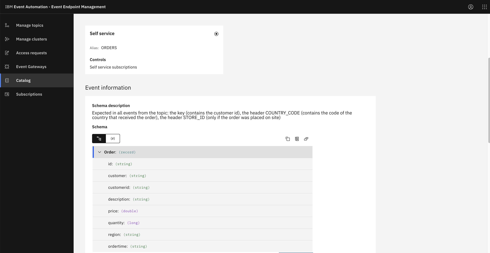
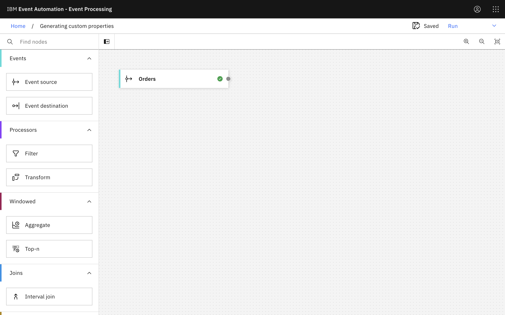
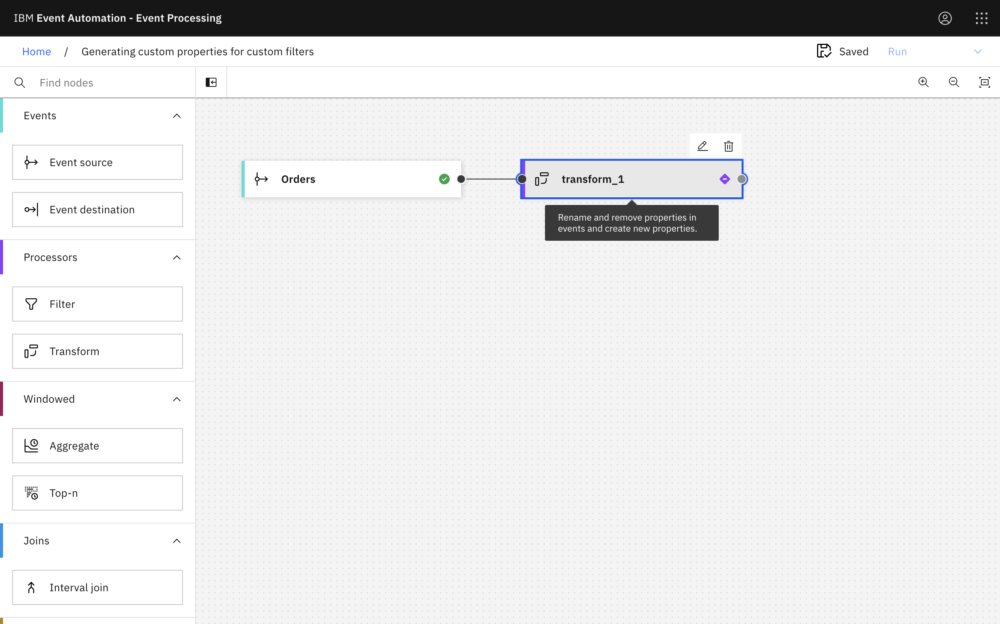
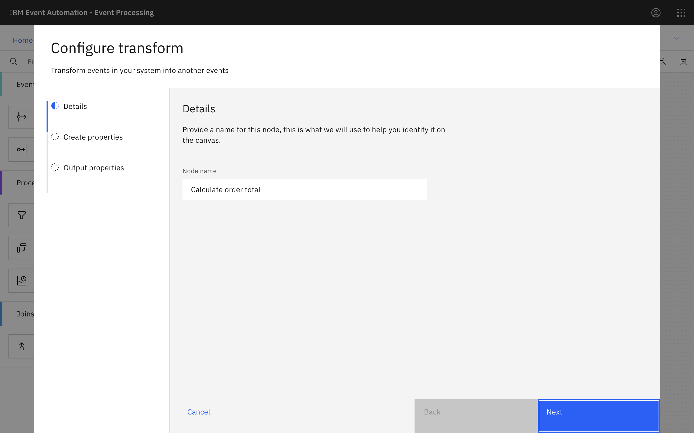
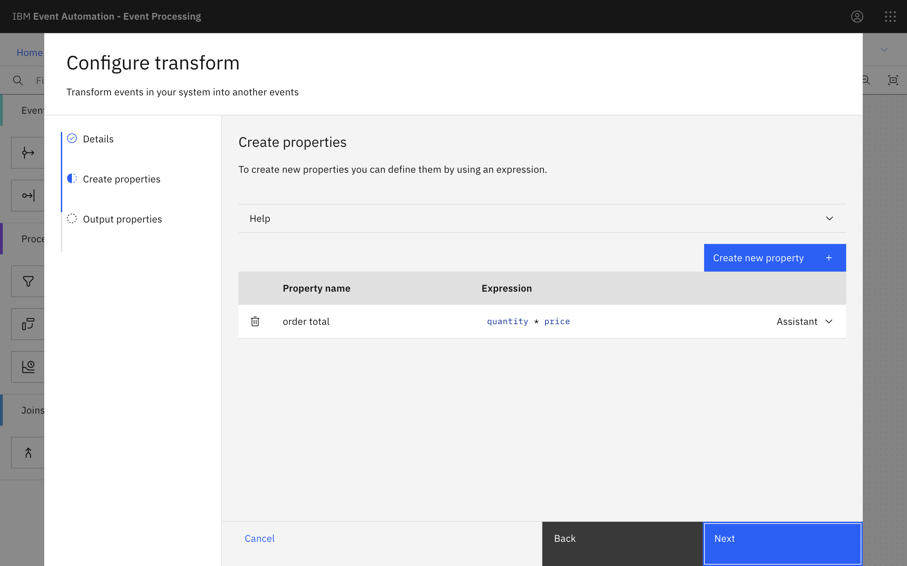
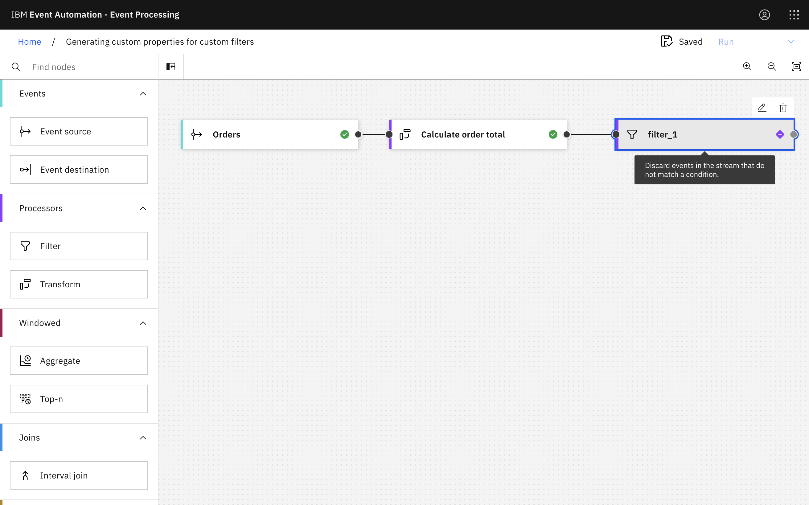
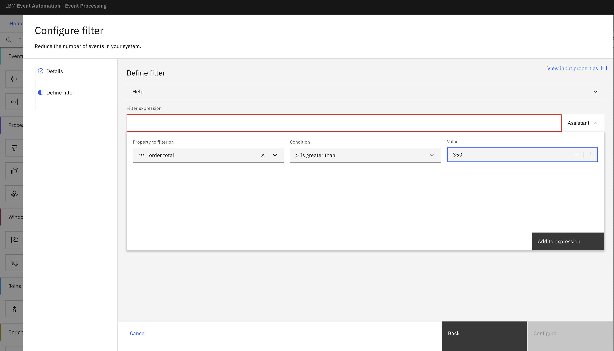
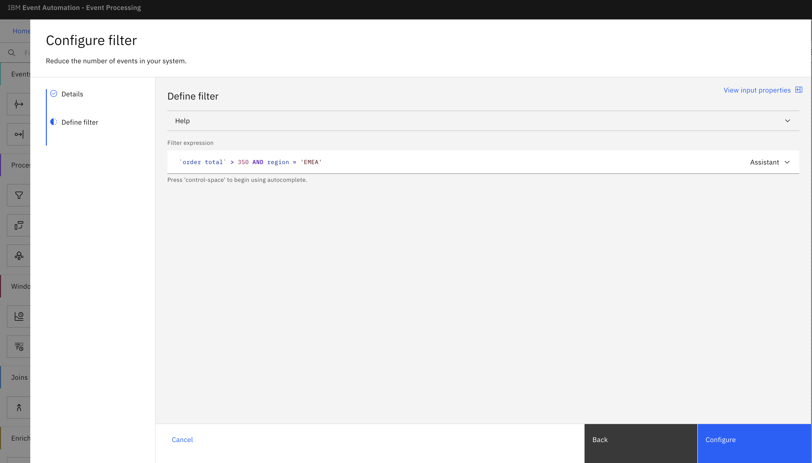
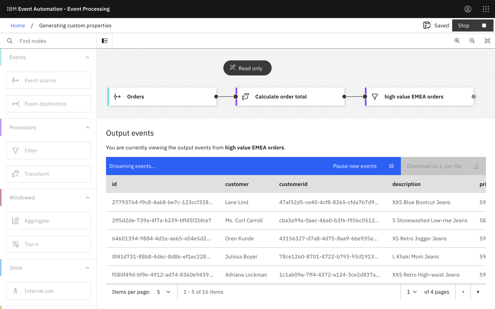

## Generating custom properties for custom filters

### Step 1 - Discover the topics to use

1. Go to the **Event Endpoint Management catalog**.


2. The Orders topic contains events about **orders** that are made.


### Step 2 - Provide a source of events

The next step is to create an event source in Event Processing for the topic to use in the flow.

Use the server address information and Generate access credentials button on the topic page in the catalog to define an event source node.



### Step 3 : Calculate order totals

1. Create a **Transform node**.

Create a transform node by dragging one onto the canvas. You can find this in the Processors section of the left panel.
Click and drag from the small gray dot on the event source to the matching dot on the transform node.

2. Hover over the transform node and click **Edit** icon Edit to configure the node.
Call the transform node Calculate order total.


3. Create a new property called order total.

An order event includes the unit cost of an item, and the quantity of items in the order. The order total can be computed by multiplying these two numbers.
Suggested value for the property:

```quantity * price```

4. You can leave the other event properties as they are.

5. Click **Configure** to finalize the transform.

### Step 4 : Identify high-value EMEA orders
The next step is to filter the stream of events based on this new total order value property to select the high value EMEA orders.

1. Add a Filter node.

Create a filter node by dragging one onto the canvas. You can find this in the Processors section of the left panel.
Click and drag from the small gray dot on the event source to the matching dot on the filter node.

2. Hover over the filter node and click Edit icon Edit to configure the node.
Name the filter node to show that it is going to select high value EMEA orders.

3. Use the assistant to start a filter based on orders with an order total greater than 350.


4. Click **Add to expression**.

5. Edit the filter so that it also only matches orders that are made in the EMEA region.


Suggested value for the filter expression:
```
`order total` > 350 AND region = 'EMEA'
```

6. Click **Configure** to finalize the filter.

### Step 5 : Test the flow
The final step is to run your event processing flow and view the results.

1. Use the Run menu, and select Include historical to run your filter on the history of order events available on this Kafka topic.

2. Click the Filter node to see a live view of results from your filter. It is updated as new events are emitted onto the orders topic.


3. When you have finished reviewing the results, you can stop this flow.